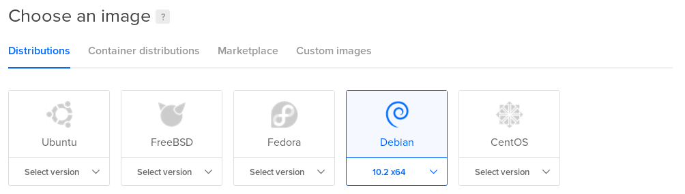
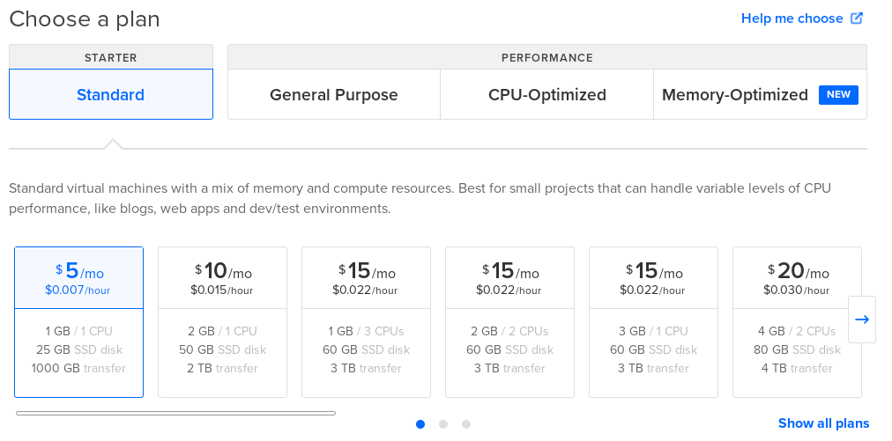
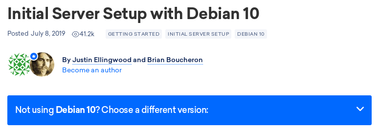

# Install on DigitalOcean


Get **$100 FREE** to start on **DigitalOcean**, if you signup using this link: [https://m.do.co/c/0ee6cb9c7ee0](https://m.do.co/c/0ee6cb9c7ee0)


## Create a Droplet

In your **DigitalOcean** dashboard, create a new **Droplet** \(VPS\) where you'll install **Bastion**.

Choose a **Linux Distribution** for your server. We recommend **Debian**.

Choose a **Pricing Plan** for your Droplet, based on your usage. If you only plan to run Bastion in your server, even the most standard plan is more than enough for your usage. But if you plan to do other stuff, choose the plan according to your needs.

Choose a **Datacenter Region** closer to your **Discord Server's Voice Region** for better latency.

Configure any additional settings based on your requirements and then create the Droplet so we can start setting up Bastion in it.

## Initial Server Setup

Once you've created your DigitalOcean Droplet, follow the [Initial Server Setup](https://www.digitalocean.com/community/tutorials/initial-server-setup-with-debian-10) guide for your Linux Distribution to setup the server for the first time.

## Install Bastion

Once you've setup your server for the first time, login to your server, preferrably as a non-root sudo-enabled user and then follow the **Bastion Linux Install** guide.



